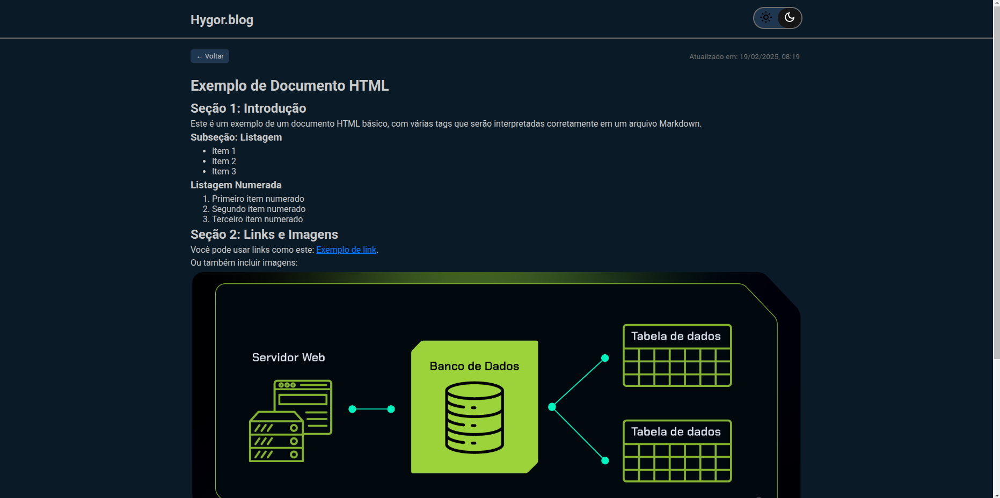

# Blog de Postagens com API do GitHub

Este é um projeto de um blog simples com JavaSript que utiliza a API do GitHub para buscar **issues** de um repositório e exibi-las como postagens em uma página. Quando o usuário clica em uma postagem, ele é redirecionado para uma página onde a postagem é exibida em detalhes, formatada com o código HTML que foi fornecido na própria **issue** do GitHub.

## Funcionalidades

- **Exibição de postagens:** As postagens são retiradas das **issues** de um repositório GitHub usando a API do GitHub.
- **Navegação entre postagens:** Ao clicar em uma postagem, o usuário é redirecionado para uma página dedicada, onde o conteúdo da **issue** é exibido com a formatação HTML da própria issue.
- **Página inicial:** Exibe uma lista de **issues** do GitHub com títulos, autor e a data de publicação.
- **Tema claro e escuro:** No header inclui um botão de alternância para mudar entre o tema claro e escuro.
#### Tela inicial:


#### Tela do post:


## Como funciona

1. **API do GitHub:** O projeto utiliza a [API do GitHub](https://developer.github.com/v3/issues/#list-issues) para buscar as issues de um repositório específico e exibi-las como postagens. Você pode alterar o repositório para o qual deseja buscar as issues, modificando a URL na variável `api`.
   
2. **Listagem de postagens:** Na página inicial, as **issues** são listadas com título, informações sobre o autor e a data de atualização. Cada item possui um link que leva à página de detalhes dessa issue. ``não gera um link compartilhavél, pois estamos utilizando JS puro, sem nodejs, o github pages não aceita``

3. **Página de Detalhes:** Quando o usuário clica em uma postagem, a página é exibida. O conteúdo da **issue** é mostrado de forma formatada, incluindo o código HTML que foi inserido na descrição da issue.
* **Importante sempre postar como HTML para exibir corretamente**

## Como rodar o projeto

### Pré-requisitos

- Navegador Chrome, Edge, Firefox... (com suporte a JavaScript)
- Conexão com a internet (para buscar as issues via API do GitHub)

### Passos

1. Clone o repositório para a sua máquina:
    ```bash
    git clone https://github.com/hygorqc/git-blog.git
    ```

2. Abra o arquivo `index.html` no seu navegador. Você deve ser capaz de ver a lista de postagens e interagir com elas.

3. Para adicionar mais personalizações ou buscar issues de outro repositório, altere a URL da API no arquivo `script.js`:
    ```javascript
    const api = 'https://api.github.com/repos/usuario/repositorio/issues';
    ```

4. A navegação para as postagens é feita sem recarregar a página. O conteúdo da postagem é renderizado com base no HTML da **issue** do GitHub.
